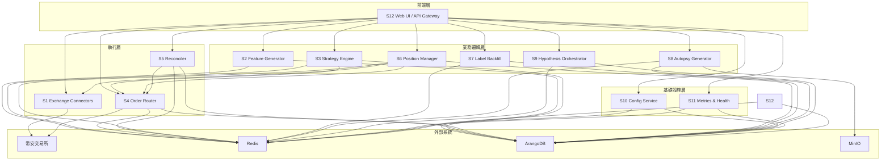

# Project Chimera 系統架構文檔

## 概述

Project Chimera 是一個基於微服務架構的高頻交易系統，由 12 個獨立的微服務組成，每個服務負責特定的功能領域，通過 HTTP API 和 Redis Streams 進行通信。

## 系統架構

### 微服務架構圖



## 服務詳細說明

### 1. S1 Exchange Connectors (8081)
- **功能**：交易所連接器，與幣安等交易所交互
- **主要 API**：`POST /xchg/treasury/transfer`
- **職責**：行情數據、訂單執行、資金劃轉

### 2. S2 Feature Generator (8082)
- **功能**：特徵計算引擎
- **主要 API**：`POST /features/recompute`
- **職責**：從市場數據生成特徵，為策略提供輸入

### 3. S3 Strategy Engine (8083)
- **功能**：策略決策引擎
- **主要 API**：`POST /decide`
- **職責**：基於特徵生成交易決策和訂單意圖

### 4. S4 Order Router (8084)
- **功能**：訂單路由引擎
- **主要 API**：`POST /orders`, `POST /cancel`
- **職責**：執行訂單、管理訂單生命周期

### 5. S5 Reconciler (8085)
- **功能**：對帳引擎
- **主要 API**：`POST /reconcile`
- **職責**：數據一致性檢查、孤兒處理

### 6. S6 Position Manager (8086)
- **功能**：持倉管理引擎
- **主要 API**：`POST /positions/manage`, `POST /auto-transfer/trigger`
- **職責**：持倉監控、移動停損、自動劃轉

### 7. S7 Label Backfill (8087)
- **功能**：標籤回填服務
- **主要 API**：`POST /labels/backfill`
- **職責**：為歷史信號添加標籤

### 8. S8 Autopsy Generator (8088)
- **功能**：交易復盤生成器
- **主要 API**：`POST /autopsy/{trade_id}`
- **職責**：生成交易復盤報告

### 9. S9 Hypothesis Orchestrator (8089)
- **功能**：假設測試編排器
- **主要 API**：`POST /experiments/run`
- **職責**：執行策略假設測試和回測

### 10. S10 Config Service (8090)
- **功能**：配置管理服務
- **主要 API**：`POST /bundles`, `POST /simulate`, `POST /promote`, `GET /active`
- **職責**：策略配置管理、推廣、模擬

### 11. S11 Metrics & Health (8091)
- **功能**：指標彙整和健康監控
- **主要 API**：`GET /metrics`, `GET /alerts`
- **職責**：系統指標收集、告警管理

### 12. S12 Web UI / API Gateway (8092)
- **功能**：Web 界面和 API 網關
- **主要 API**：`POST /kill-switch`, `POST /treasury/transfer`
- **職責**：用戶界面、系統控制、資金劃轉

## 數據流

### 1. 交易決策流程
```
S2 (特徵計算) → S3 (策略決策) → S4 (訂單執行) → S1 (交易所)
```

### 2. 持倉管理流程
```
S6 (持倉監控) → S4 (訂單執行) → S1 (交易所)
```

### 3. 資金劃轉流程
```
S12 (對外接口) → S1 (內部執行) → 幣安 API
S6 (自動觸發) → S12 (內部接口) → S1 (執行)
```

### 4. 配置管理流程
```
S12 (配置管理) → S10 (配置服務) → Redis Stream → 各服務
```

## 通信模式

### HTTP API
- **同步通信**：服務間直接 API 調用
- **RESTful**：標準的 REST API 設計
- **JSON**：統一的 JSON 數據格式

### Redis Streams
- **異步通信**：事件驅動的異步通信
- **事件流**：`mkt:*`, `cfg:events`, `signals:new`
- **可靠性**：消息持久化和重試機制

## 數據存儲

### ArangoDB
- **文檔數據庫**：存儲交易數據、配置、日誌
- **圖數據庫**：存儲服務間關係
- **全文搜索**：支援複雜查詢

### Redis
- **緩存**：高頻數據緩存
- **會話**：用戶會話管理
- **事件流**：消息隊列和事件流
- **分散鎖**：併發控制

### MinIO
- **對象存儲**：文件存儲
- **報告存儲**：復盤報告、圖表
- **備份**：數據備份

## 監控與告警

### 健康檢查
- **統一格式**：所有服務提供 `/health` 和 `/ready`
- **依賴檢查**：檢查 Redis、ArangoDB 等依賴
- **狀態報告**：OK/DEGRADED/ERROR 狀態

### 指標監控
- **服務指標**：延遲、吞吐量、錯誤率
- **業務指標**：PnL、成交量、成功率
- **系統指標**：CPU、記憶體、連接數

### 告警系統
- **多級告警**：INFO/WARN/ERROR/FATAL
- **自動處理**：熔斷、回滾、重試
- **通知機制**：郵件、簡訊、Webhook

## 安全設計

### 認證授權
- **JWT Token**：基於 JWT 的認證
- **RBAC**：基於角色的訪問控制
- **API 網關**：統一的認證入口

### 數據安全
- **加密傳輸**：HTTPS/WSS 加密
- **敏感數據**：API 密鑰等敏感數據保護
- **審計日誌**：完整的操作審計

### 風險控制
- **參數驗證**：嚴格的輸入驗證
- **限流控制**：API 調用頻率限制
- **分散鎖**：避免併發衝突

## 部署架構

### 容器化
- **Docker**：每個服務獨立容器
- **多階段構建**：優化鏡像大小
- **Git 集成**：構建時注入 Git 信息

### 編排
- **Kubernetes**：容器編排和管理
- **服務發現**：自動服務發現
- **負載均衡**：自動負載均衡

### 配置管理
- **環境變量**：運行時配置
- **ConfigMap**：Kubernetes 配置管理
- **Secret**：敏感配置管理

## 開發規範

### API 設計
- **RESTful**：遵循 REST 設計原則
- **版本控制**：API 版本管理
- **文檔生成**：Swagger/OpenAPI 文檔

### 錯誤處理
- **統一格式**：標準錯誤回應格式
- **錯誤碼**：統一的錯誤碼體系
- **重試機制**：自動重試和退避

### 日誌規範
- **結構化日誌**：JSON 格式日誌
- **日誌等級**：DEBUG/INFO/WARN/ERROR/FATAL
- **關聯 ID**：請求追蹤和關聯

## 擴展性設計

### 水平擴展
- **無狀態設計**：服務無狀態設計
- **負載均衡**：支援多實例部署
- **數據分片**：數據庫分片支援

### 垂直擴展
- **資源隔離**：服務間資源隔離
- **性能優化**：單服務性能優化
- **緩存策略**：多層緩存設計

## 故障處理

### 熔斷機制
- **服務熔斷**：服務異常時自動熔斷
- **降級策略**：服務降級和限流
- **恢復機制**：自動恢復和重試

### 數據一致性
- **最終一致性**：分散式數據最終一致性
- **補償機制**：數據不一致補償
- **對帳機制**：定期數據對帳

### 災難恢復
- **備份策略**：多層備份策略
- **恢復流程**：災難恢復流程
- **數據同步**：跨區域數據同步