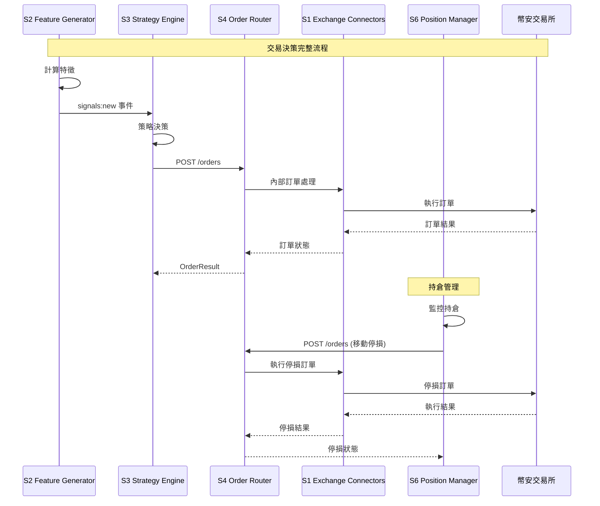
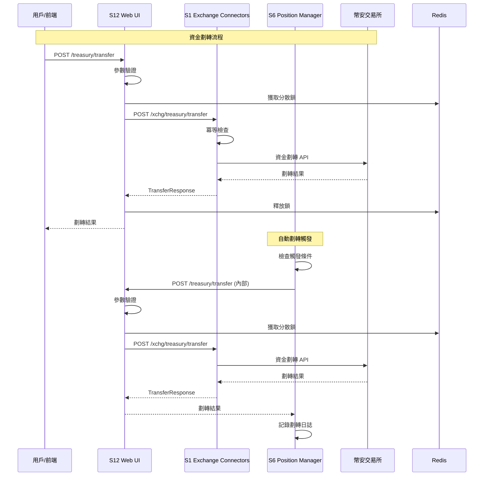
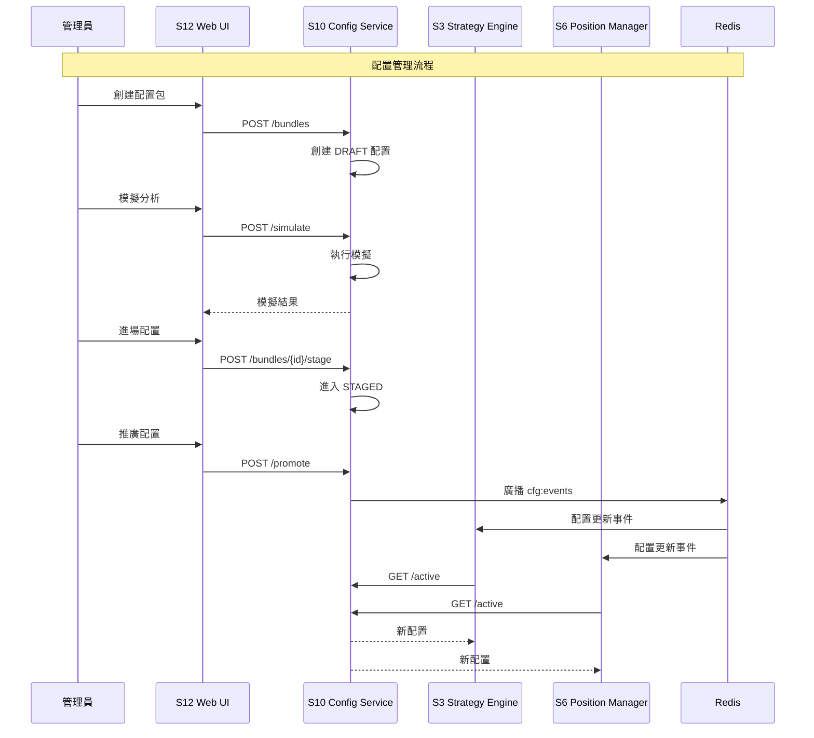
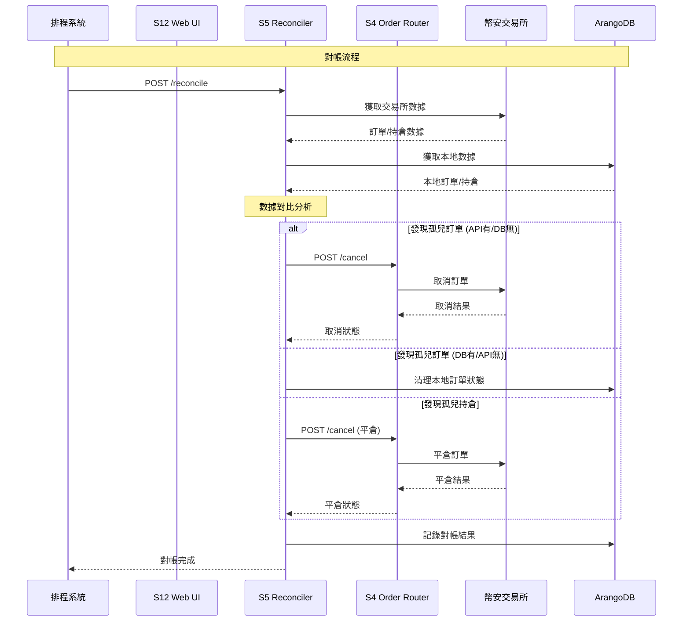
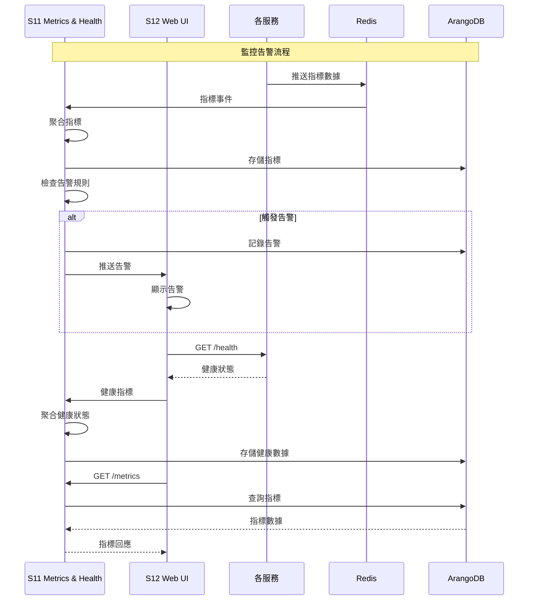

# Project Chimera 服務間交互圖

## 系統架構圖

```mermaid
graph TB
    subgraph "前端層"
        UI[S12 Web UI / API Gateway<br/>:8092]
    end
    
    subgraph "業務邏輯層"
        S2[S2 Feature Generator<br/>:8082]
        S3[S3 Strategy Engine<br/>:8083]
        S6[S6 Position Manager<br/>:8086]
        S7[S7 Label Backfill<br/>:8087]
        S8[S8 Autopsy Generator<br/>:8088]
        S9[S9 Hypothesis Orchestrator<br/>:8089]
    end
    
    subgraph "執行層"
        S1[S1 Exchange Connectors<br/>:8081]
        S4[S4 Order Router<br/>:8084]
        S5[S5 Reconciler<br/>:8085]
    end
    
    subgraph "基礎設施層"
        S10[S10 Config Service<br/>:8090]
        S11[S11 Metrics & Health<br/>:8091]
    end
    
    subgraph "外部系統"
        BINANCE[幣安交易所]
        REDIS[Redis<br/>事件流/緩存]
        ARANGO[ArangoDB<br/>數據存儲]
        MINIO[MinIO<br/>文件存儲]
    end
    
    %% 前端到業務邏輯層
    UI -->|POST /features/recompute| S2
    UI -->|POST /decide| S3
    UI -->|POST /positions/manage| S6
    UI -->|POST /labels/backfill| S7
    UI -->|POST /autopsy/{trade_id}| S8
    UI -->|POST /experiments/run| S9
    
    %% 前端到基礎設施層
    UI -->|POST /bundles, /simulate, /promote| S10
    UI -->|GET /metrics, /alerts| S11
    
    %% 前端到執行層
    UI -->|POST /xchg/treasury/transfer| S1
    UI -->|POST /cancel| S4
    UI -->|POST /reconcile| S5
    
    %% 業務邏輯層內部交互
    S2 -->|signals:new| S3
    S3 -->|POST /orders| S4
    S6 -->|POST /orders| S4
    S6 -->|POST /xchg/treasury/transfer| S1
    
    %% 執行層內部交互
    S5 -->|POST /cancel| S4
    
    %% 配置分發
    S10 -->|cfg:events| S2
    S10 -->|cfg:events| S3
    S10 -->|cfg:events| S4
    S10 -->|cfg:events| S5
    S10 -->|cfg:events| S6
    S10 -->|cfg:events| S12
    
    %% 外部系統連接
    S1 -->|API 調用| BINANCE
    S4 -->|API 調用| BINANCE
    
    %% 數據存儲連接
    S2 --> REDIS
    S3 --> REDIS
    S4 --> REDIS
    S5 --> REDIS
    S6 --> REDIS
    S7 --> REDIS
    S8 --> REDIS
    S9 --> REDIS
    S10 --> REDIS
    S11 --> REDIS
    S12 --> REDIS
    
    S2 --> ARANGO
    S3 --> ARANGO
    S4 --> ARANGO
    S5 --> ARANGO
    S6 --> ARANGO
    S7 --> ARANGO
    S8 --> ARANGO
    S9 --> ARANGO
    S10 --> ARANGO
    S11 --> ARANGO
    S12 --> ARANGO
    
    S8 --> MINIO
```

## 交易決策流程圖



## 資金劃轉流程圖



## 配置管理流程圖



## 對帳流程圖



## 監控告警流程圖


