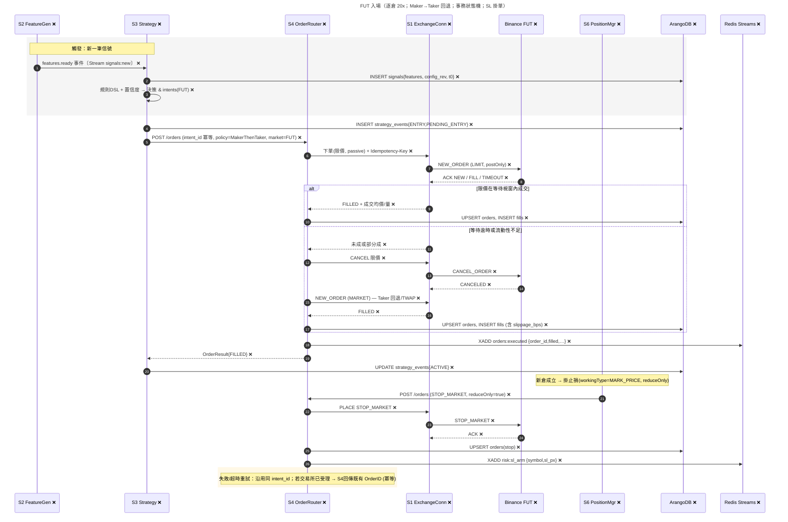
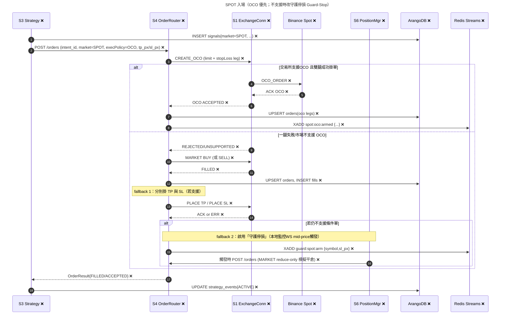
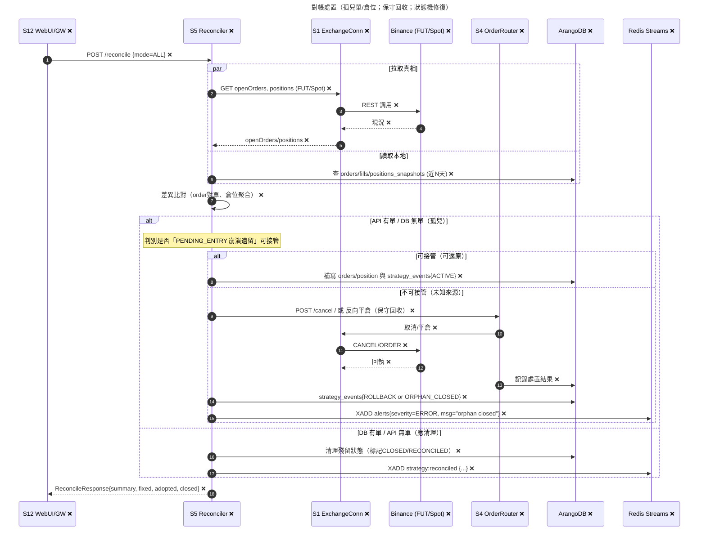

# 核心時序圖

**實作進度：0/12 服務已完成 (0%)**

## 1) FUT 入場（Maker→Taker 回退、事務狀態機、SL 掛單）❌ **[未實作]**

### 要點

- ❌ **intent_id 作為冪等鍵**；Maker 等待視窗逾時即回退至 MARKET/TWAP **[S4未實作]**
- ❌ **成功後 S6 立刻「撤舊掛新」或「新掛」STOP_MARKET**（reduceOnly=true, workingType=MARK_PRICE）**[S6未實作]**
- ❌ **事務狀態**：PENDING_ENTRY → ACTIVE，全程寫 strategy_events **[S3未實作]**

## 2) SPOT 入場（OCO / 守護停損 fallback）❌ **[未實作]**

### 要點

- ❌ **OCO 優先**。若一腿失敗或不支援，回退為：先入場 → 掛單 TP/SL；再不支援 → 守護停損（本地）**[S4未實作]**
- ❌ **守護停損由 S4/或 S6 監控 WS 價格觸發**，落地為 市價反向單；每一步都寫 DB 與 Streams **[S4/S6未實作]**

## 3) 對帳處置（孤兒訂單/倉位、狀態機修復、保守回收）❌ **[未實作]**

### 要點

- ❌ **對帳分兩側「交易所真相」vs「DB 記錄」**；孤兒先判定能否「安全接管」，不可接管 → 保守回收（取消/平倉）**[S5未實作]**
- ❌ **全程寫 strategy_events 與 alerts**，回傳摘要供 UI 呈現 **[S5未實作]**

## 附：統一約束（在三張圖都適用）

### 冪等性
- ❌ **下單/劃轉請務必帶 intent_id 或 Idempotency-Key**；重送同鍵由 S4/S1 回同結果 **[S4未實作]**

### 事件流
- ❌ **關鍵狀態變更需推送至對應 Streams**（如 orders:executed, spot:oco:armed, risk:sl_arm 等），以便其他服務（S6/S11/S12）即時消費 **[S1-S3未實作]**

### 狀態機
- ❌ **PENDING_ENTRY → ACTIVE → (PENDING_CLOSING) → CLOSED**，任何異常在對帳重放時能恢復正確狀態 **[S3未實作]**

### 保守回收原則
- ❌ **遇到不可識別或無法接管的殘留/孤兒，優先降低風險**（取消/平倉），並寫審計 **[S5未實作]**

---

## 📊 實作進度總結

### ❌ 全部未實作 (0%)
- **S1 Exchange Connectors**：WebSocket連接、REST API調用、交易所通信
- **S2 Feature Generator**：特徵計算、事件推送
- **S3 Strategy Engine**：決策邏輯、狀態機、事件記錄
- **S4 Order Router**：訂單執行、Maker→Taker回退、TWAP、OCO處理
- **S5 Reconciler**：對帳邏輯、孤兒處置、狀態修復
- **S6 Position Manager**：倉位管理、止損掛單
- **S12 Web UI**：API Gateway、對帳觸發
- **基礎設施**：ArangoDB、Redis Streams

### 🎯 建議優先順序
1. **基礎設施** - ArangoDB、Redis Streams
2. **S1 Exchange Connectors** - 交易所通信基礎
3. **S2 Feature Generator** - 特徵計算
4. **S3 Strategy Engine** - 決策邏輯核心
5. **S4 Order Router** - 訂單執行核心
6. **S5 Reconciler** - 數據一致性保證
7. **S6 Position Manager** - 倉位管理
8. **S12 Web UI** - 用戶界面和API代理

### 🔄 關鍵流程狀態
- **FUT入場流程**：全部未實作
- **SPOT入場流程**：全部未實作  
- **對帳處置流程**：全部未實作